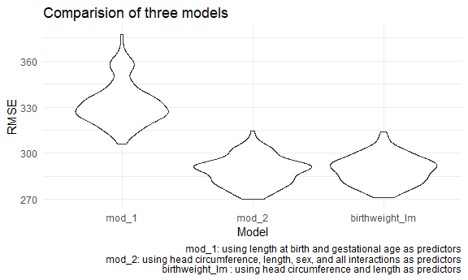

p8105\_hw6\_xh2470
================

``` r
library(tidyverse)
```

    ## -- Attaching packages --------------------------------------- tidyverse 1.3.1 --

    ## v ggplot2 3.3.5     v purrr   0.3.4
    ## v tibble  3.1.4     v dplyr   1.0.7
    ## v tidyr   1.1.3     v stringr 1.4.0
    ## v readr   2.0.1     v forcats 0.5.1

    ## -- Conflicts ------------------------------------------ tidyverse_conflicts() --
    ## x dplyr::filter() masks stats::filter()
    ## x dplyr::lag()    masks stats::lag()

``` r
library(viridis)
```

    ## Loading required package: viridisLite

``` r
library(modelr)
library(mgcv)
```

    ## Loading required package: nlme

    ## 
    ## Attaching package: 'nlme'

    ## The following object is masked from 'package:dplyr':
    ## 
    ##     collapse

    ## This is mgcv 1.8-38. For overview type 'help("mgcv-package")'.

``` r
knitr::opts_chunk$set(
  echo = TRUE,
  warning = FALSE,
  fig.width = 6,
  fig.asp = .6,
  out.width = "90%"
)

 theme_set(theme_minimal() + theme(legend.position = "bottom"))

options(
  ggplot2.continuous.colour = "viridis",
  ggplot2.continuous.fill = "viridis"
)

scale_colour_discrete = scale_colour_viridis_d
scale_fill_discrete = scale_fill_viridis_d
```

# Problem 1

#### Load and clean the data.

``` r
birthweight = 
  read_csv("./data/birthweight.csv") %>% 
  rename(head_circ = bhead,
         length = blength,
         birthweight = bwt,
         ges_age = gaweeks) %>% 
  mutate(sex = recode(babysex, `1` = "Male", `2` = "Female"))
```

    ## Rows: 4342 Columns: 20

    ## -- Column specification --------------------------------------------------------
    ## Delimiter: ","
    ## dbl (20): babysex, bhead, blength, bwt, delwt, fincome, frace, gaweeks, malf...

    ## 
    ## i Use `spec()` to retrieve the full column specification for this data.
    ## i Specify the column types or set `show_col_types = FALSE` to quiet this message.

#### Propose a regression model for birthweight.

``` r
birthweight_lm = 
  birthweight %>%
  select(birthweight, head_circ, length) %>% 
  drop_na() 

fit = lm(birthweight ~ head_circ + length, data = birthweight_lm) 

fit %>% 
  broom::tidy() %>% 
  select(term, estimate, p.value) %>%
  mutate(term = str_replace(term, "head_circ", "Head Circumference"),
         term = str_replace(term, "length", "Length")) %>% 
  knitr::kable(digits = 3)
```

| term               |  estimate | p.value |
|:-------------------|----------:|--------:|
| (Intercept)        | -6029.620 |       0 |
| Head Circumference |   146.021 |       0 |
| Length             |    85.030 |       0 |

I want to identify whether baby’s head circumference and length at birth
could have an influence on baby’s birth weight. Thus, I process the
above linear regression model. First, I select related variables
`birthweight`, `head_circ`,and `length` from the original dataset, and
drop missing values. Second, I make a linear regression model by using
`birthweight` as the response and `head_circ` and `length` as
predictors. Third, tidy the resutls and show it in a table.

#### Make a plot of model residuals against fitted values.

``` r
modelr::add_residuals(birthweight_lm, fit) %>%
  modelr::add_predictions(fit) %>% 
  ggplot(aes(x = pred, y = resid)) +
  geom_violin() +
  labs(
    title = "Residuals vs. Fitted Values",
    x = "Prediction",
    y = "Residuals"
  )
```


From the plot, we can see that among fitted values, residuals are
distributed around 0.

#### Compare the above model to two others.

``` r
birthweight_df =
  birthweight %>%
  select(birthweight, length, ges_age, head_circ, sex) %>% 
  crossv_mc(100) %>%
  mutate(
    train = map(train, as_tibble),
    test = map(test, as_tibble)) %>% 
   mutate(
    mod_1  = map(train, ~lm(birthweight ~ length + ges_age, data = .x)),
    mod_2  = map(train, ~lm(birthweight ~ head_circ * sex + length * sex, data = .x)),
    birthweight_lm  = map(train, ~lm(birthweight ~ head_circ + length, data = .x))
    ) %>% 
  mutate(
    rmse_mod_1 = map2_dbl(mod_1, test, ~rmse(model = .x, data = .y)),
    rmse_mod_2 = map2_dbl(mod_2, test, ~rmse(model = .x, data = .y)),
    rmse_birthweight_lm = map2_dbl(birthweight_lm, test, ~rmse(model = .x, data = .y)))

birthweight_df %>% 
  select(starts_with("rmse")) %>% 
  pivot_longer(
    everything(),
    names_to = "model", 
    values_to = "rmse",
    names_prefix = "rmse_") %>% 
  mutate(model = fct_inorder(model)) %>% 
  ggplot(aes(x = model, y = rmse)) + 
  geom_violin() + 
  labs(
    title = "Comparision of three models",
    x = "Model",
    y = "RMSE",
    caption = "mod_1: using length at birth and gestational age as predictors
               mod_2: using head circumference, length, sex, and all interactions as predictors
               birthweight_lm : using head circumference and length as predictors"
  )
```


