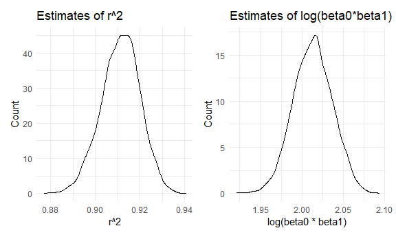

p8105\_hw6\_xh2470
================

``` r
library(tidyverse)
```

    ## -- Attaching packages --------------------------------------- tidyverse 1.3.1 --

    ## v ggplot2 3.3.5     v purrr   0.3.4
    ## v tibble  3.1.4     v dplyr   1.0.7
    ## v tidyr   1.1.3     v stringr 1.4.0
    ## v readr   2.0.1     v forcats 0.5.1

    ## -- Conflicts ------------------------------------------ tidyverse_conflicts() --
    ## x dplyr::filter() masks stats::filter()
    ## x dplyr::lag()    masks stats::lag()

``` r
library(patchwork)
library(viridis)
```

    ## Loading required package: viridisLite

``` r
library(modelr)
library(mgcv)
```

    ## Loading required package: nlme

    ## 
    ## Attaching package: 'nlme'

    ## The following object is masked from 'package:dplyr':
    ## 
    ##     collapse

    ## This is mgcv 1.8-38. For overview type 'help("mgcv-package")'.

``` r
knitr::opts_chunk$set(
  echo = TRUE,
  warning = FALSE,
  fig.width = 6,
  fig.asp = .6,
  out.width = "90%"
)

 theme_set(theme_minimal() + theme(legend.position = "bottom"))

options(
  ggplot2.continuous.colour = "viridis",
  ggplot2.continuous.fill = "viridis"
)

scale_colour_discrete = scale_colour_viridis_d
scale_fill_discrete = scale_fill_viridis_d
```

# Problem 1

#### Load and clean the data.

``` r
birthweight = 
  read_csv("./data/birthweight.csv") %>% 
  rename(head_circ = bhead,
         length = blength,
         birthweight = bwt,
         ges_age = gaweeks) %>% 
  mutate(sex = recode(babysex, `1` = "Male", `2` = "Female"))
```

    ## Rows: 4342 Columns: 20

    ## -- Column specification --------------------------------------------------------
    ## Delimiter: ","
    ## dbl (20): babysex, bhead, blength, bwt, delwt, fincome, frace, gaweeks, malf...

    ## 
    ## i Use `spec()` to retrieve the full column specification for this data.
    ## i Specify the column types or set `show_col_types = FALSE` to quiet this message.

#### Propose a regression model for birthweight.

``` r
birthweight_lm = 
  birthweight %>%
  select(birthweight, head_circ, length) %>% 
  drop_na() 

fit = lm(birthweight ~ head_circ + length, data = birthweight_lm) 

fit %>% 
  broom::tidy() %>% 
  select(term, estimate, p.value) %>%
  mutate(term = str_replace(term, "head_circ", "Head Circumference"),
         term = str_replace(term, "length", "Length")) %>% 
  knitr::kable(digits = 3)
```

| term               |  estimate | p.value |
|:-------------------|----------:|--------:|
| (Intercept)        | -6029.620 |       0 |
| Head Circumference |   146.021 |       0 |
| Length             |    85.030 |       0 |

I want to identify whether baby’s head circumference and length at birth
could have an influence on baby’s birth weight. Thus, I process the
above linear regression model. First, I select related variables
`birthweight`, `head_circ`,and `length` from the original dataset, and
drop missing values. Second, I make a linear regression model by using
`birthweight` as the response and `head_circ` and `length` as
predictors. Third, tidy the resutls and show it in a table.

#### Make a plot of model residuals against fitted values.

``` r
modelr::add_residuals(birthweight_lm, fit) %>%
  modelr::add_predictions(fit) %>% 
  ggplot(aes(x = pred, y = resid)) +
  geom_violin() +
  labs(
    title = "Residuals vs. Fitted Values",
    x = "Prediction",
    y = "Residuals"
  )
```


From the plot, we can see that among fitted values, residuals are
distributed around 0.

#### Compare the above model to two others.

``` r
birthweight_df =
  birthweight %>%
  select(birthweight, length, ges_age, head_circ, sex) %>% 
  crossv_mc(100) %>%
  mutate(
    train = map(train, as_tibble),
    test = map(test, as_tibble)) %>% 
   mutate(
    mod_1  = map(train, ~lm(birthweight ~ length + ges_age, data = .x)),
    mod_2  = map(train, ~lm(birthweight ~ head_circ * sex + length * sex, data = .x)),
    birthweight_lm  = map(train, ~lm(birthweight ~ head_circ + length, data = .x))
    ) %>% 
  mutate(
    rmse_mod_1 = map2_dbl(mod_1, test, ~rmse(model = .x, data = .y)),
    rmse_mod_2 = map2_dbl(mod_2, test, ~rmse(model = .x, data = .y)),
    rmse_birthweight_lm = map2_dbl(birthweight_lm, test, ~rmse(model = .x, data = .y)))

birthweight_df %>% 
  select(starts_with("rmse")) %>% 
  pivot_longer(
    everything(),
    names_to = "model", 
    values_to = "rmse",
    names_prefix = "rmse_") %>% 
  mutate(model = fct_inorder(model)) %>% 
  ggplot(aes(x = model, y = rmse)) + 
  geom_violin() + 
  labs(
    title = "Comparision of three models",
    x = "Model",
    y = "RMSE",
    caption = "mod_1: using length at birth and gestational age as predictors
               mod_2: using head circumference, length, sex, and all interactions as predictors
               birthweight_lm : using head circumference and length as predictors"
  )
```


# Problem 2

``` r
weather_df = 
  rnoaa::meteo_pull_monitors(
    c("USW00094728"),
    var = c("PRCP", "TMIN", "TMAX"), 
    date_min = "2017-01-01",
    date_max = "2017-12-31") %>%
  mutate(
    name = recode(id, USW00094728 = "CentralPark_NY"),
    tmin = tmin / 10,
    tmax = tmax / 10) %>%
  select(name, id, everything())
```

    ## Registered S3 method overwritten by 'hoardr':
    ##   method           from
    ##   print.cache_info httr

    ## using cached file: C:\Users\DELL\AppData\Local/Cache/R/noaa_ghcnd/USW00094728.dly

    ## date created (size, mb): 2021-09-16 13:52:18 (7.614)

    ## file min/max dates: 1869-01-01 / 2021-09-30

#### Use 5000 bootstrap samples to produce estimates of quantities.

``` r
boot_strap = 
  weather_df %>%
  bootstrap(n = 5000, id = "strap_number") %>% 
  mutate(
    models = map(.x = strap, ~lm(tmax ~ tmin, data = .x)),
    r_square = map(models, broom::glance),
    results = map(models, broom::tidy)
  ) %>% 
  select(strap_number, r_square, results) 

r_square = 
  boot_strap %>% 
  unnest(r_square) %>% 
  select(strap_number, r.squared)

r_square
```

    ## # A tibble: 5,000 x 2
    ##    strap_number r.squared
    ##    <chr>            <dbl>
    ##  1 0001             0.912
    ##  2 0002             0.908
    ##  3 0003             0.928
    ##  4 0004             0.910
    ##  5 0005             0.910
    ##  6 0006             0.912
    ##  7 0007             0.905
    ##  8 0008             0.914
    ##  9 0009             0.914
    ## 10 0010             0.918
    ## # ... with 4,990 more rows

``` r
intercept = 
  boot_strap %>% 
  unnest(results) %>%
  select(strap_number,term, estimate) %>% 
  mutate(
    term = recode(term, `(Intercept)` = "beta0_hat", `tmin` = "beta1_hat")
  ) %>% 
  pivot_wider(
    names_from = "term",
    values_from = "estimate"
  ) %>% 
  mutate(log = log10(beta0_hat * beta1_hat))

intercept
```

    ## # A tibble: 5,000 x 4
    ##    strap_number beta0_hat beta1_hat   log
    ##    <chr>            <dbl>     <dbl> <dbl>
    ##  1 0001              6.97      1.05 0.863
    ##  2 0002              7.49      1.03 0.887
    ##  3 0003              6.88      1.07 0.865
    ##  4 0004              7.24      1.03 0.873
    ##  5 0005              7.27      1.05 0.881
    ##  6 0006              7.15      1.05 0.875
    ##  7 0007              7.39      1.04 0.888
    ##  8 0008              7.18      1.03 0.867
    ##  9 0009              7.31      1.03 0.877
    ## 10 0010              6.82      1.05 0.855
    ## # ... with 4,990 more rows

#### Plot the distribution of estimates.

``` r
r_square_plot = 
r_square %>% 
  ggplot(aes(x = r.squared)) +
  geom_density() + 
  labs(
    title = "Estimates of r square",
    x = "r square",
    y = "Count"
  )

intercept_plot = 
intercept %>% 
  ggplot(aes(x = log)) +
  geom_density() + 
  labs(
    title = "Estimates of log(beta0 * beta1)",
    x = "log(beta0 * beta1)",
    y = "Count"
  )  

r_square_plot + intercept_plot
```



From the plots, we can see that the distribution of both estimates r
square and log(beta0\*beta1) are approximately normally distributed. The
closer r square is to 1, the better the model fitting effect is.

#### Provide 95% confidence interval for the estimates.

``` r
r_square_ci = 
  r_square %>% 
  summarize(
    ci_lower = quantile(r.squared, 0.025), 
    ci_upper = quantile(r.squared, 0.975))  

r_square_ci
```

    ## # A tibble: 1 x 2
    ##   ci_lower ci_upper
    ##      <dbl>    <dbl>
    ## 1    0.894    0.928

``` r
intercept_ci = 
  intercept %>% 
  summarize(
    ci_lower = quantile(log, 0.025), 
    ci_upper = quantile(log, 0.975))  

intercept_ci
```

    ## # A tibble: 1 x 2
    ##   ci_lower ci_upper
    ##      <dbl>    <dbl>
    ## 1    0.854    0.895

The lower limit and upper limit of 95% confidence interval for r square
is **0.894** and **0.928**, respectively. The lower limit and upper
limit of 95% confidence interval for log(beta0 \* beta1) is **0.854**
and **0.895**, respectively.
